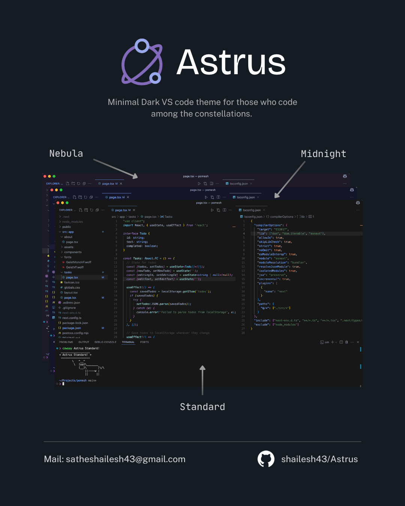

## Installation for VS code

1. Open VS Code and go to the Extensions view (Ctrl+Shift+X).
2. Search for "Astrus" and click Install.
Select a variant:
3. Go to File ➩ Preferences ➩ Color Theme or press Ctrl+K, Ctrl+T.
4. Choose any suitable theme among them as per your need!

## Contribute

Feedback and contributions are welcome!

- Open an issue or pull request at [Astrus](https://github.com/shailesh43/Astrus).

- Share suggestions for improving colors or adding support for additional languages.

## License

This theme is licensed under the MIT License.
