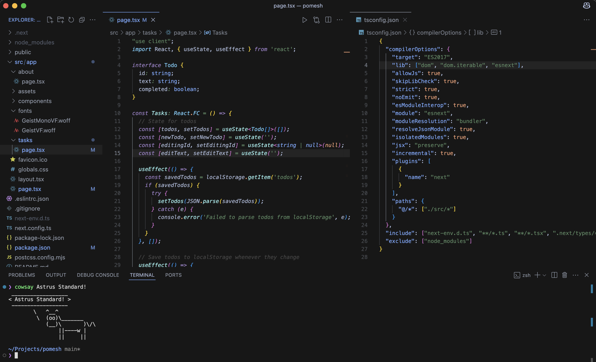

A minimalist dark theme for Visual Studio Code, inspired by the serene beauty of midnight skies and starlight. Designed for clarity and comfort, it features a sleek and a carefully curated palette of purple, teal, blue, and peach-pink accents.

### Variants

- Astrus Standard: Dark gray-black background (#222222) with minimal purple and peach-pink accents for a high-contrast, ultra-dark experience.

- Astrus Midnight: Deep near-black background (#0D1117) with blue and teal highlights, evoking a starry night.

- Astrus Nebula: Near-black background (#050406) with vibrant purple, teal, blue, and peach-pink accents for a balanced, modern feel.

### Installation for VS code

1. Open VS Code and go to the Extensions view (Ctrl+Shift+X).
2. Search for "Astrus" and click Install.
Select a variant:
3. Go to File > Preferences > Color Theme or press Ctrl+K, Ctrl+T.
4. Choose Astrus Standard, Astrus Midnight, or Astrus Black as per your choice :>

### Contribute 
Feedback and contributions are welcome!

- Open an issue or pull request at [Astrus](https://github.com/shailesh43/Astrus).

- Share suggestions for improving colors or adding support for additional languages.
- You can contact here at my [gmail](satheshailesh43@gmail.com).

### License
This theme is licensed under the MIT License.
